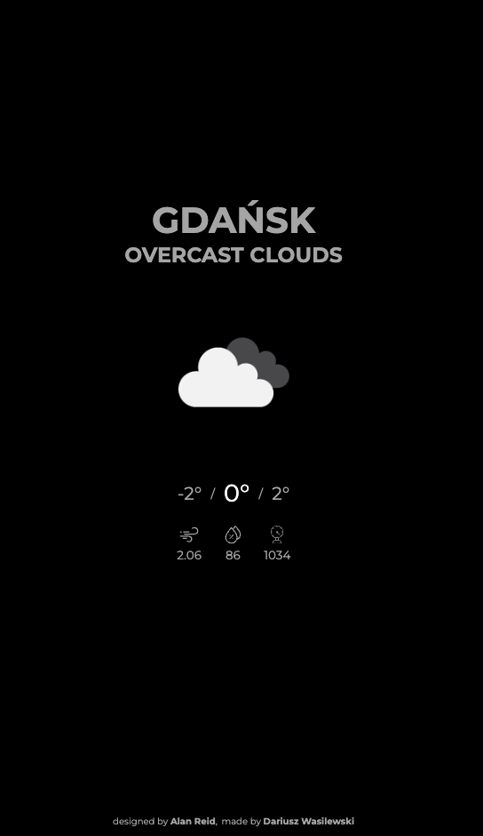

# tert-weather

Weather app based on https://dribbble.com/r3id design made with JavaScript, Parcel.js.

## Live

https://tert-weather.netlify.app/

## Technologies

- Front-end stack:
  - `JavaScript`
  - `axios`
  - `gsap`
  - `parcel`
- API: https://openweathermap.org/

## Usage

Installation: `npm i`

Dev: `npm watch`

Build: `npm run build`

## Screenshot
